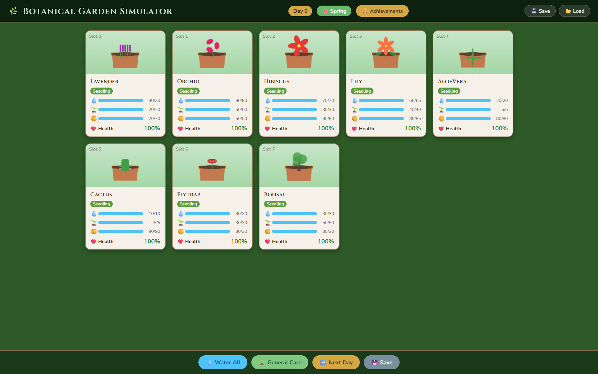
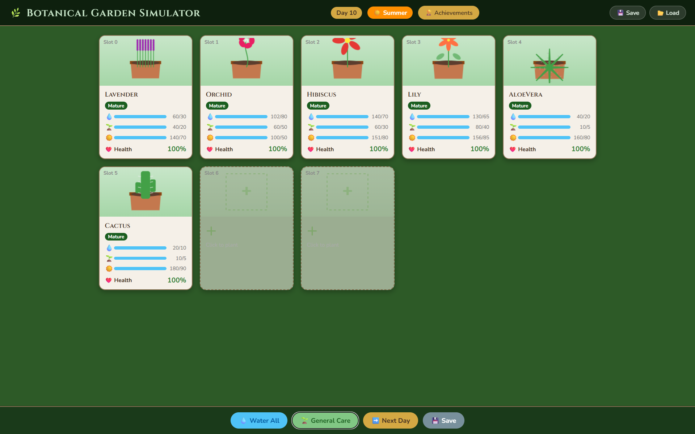

# 🌿 Botanical Garden Simulator

[](https://github.com/erihhh6/OOPproject/actions/workflows/cmake.yml)
[](https://en.cppreference.com/w/cpp/23)
[](LICENSE)

A garden management game where you care for 8 plant slots across four rotating seasons.
Keep your plants alive by managing their water, fertilizer, and light needs — and watch them grow from seedlings to blooming beauties.

---

## 🖼️ Screenshots





---

## 🎮 Play in Browser

**Open `garden-simulator.html` directly in any modern browser — no installation needed.**

Features:
- Full canvas-rendered plant graphics with breathing animations
- Clickable slots: add plants, care for them, view history
- Day-sweep animation + season transition overlays
- Achievement notifications (toast pop-ups)
- JSON save / load (exports a file, imports it back)

---

## Features

- **8 plant types**: Lavender, Orchid, Hibiscus, Lily, AloeVera, Cactus, Flytrap, Bonsai
- **4 intermediate types**: Flowering, Tropical, Cacti, Exotic — each with differentiated decay rates
- **Growth stages**: Seedling → Growing → Mature → Blooming (advances after N consecutive healthy days)
- **Season system**: Spring, Summer, Autumn, Winter (every 10 days; affects decay rates)
- **Achievement system**: 10 unlockable achievements tracked via Observer pattern
- **Save / Load**: Pipe-delimited text file (C++) or JSON download/upload (browser)
- **Plant history**: Per-plant event log viewable in the care modal (browser) or garden display (CLI)

---

## 🔧 C++ CLI Version

### Build

```bash
cmake -S . -B build -DCMAKE_BUILD_TYPE=Release
cmake --build build
```

Requires CMake ≥ 3.26 and a C++23-capable compiler (GCC 12+, Clang 18+, MSVC 2022+).

### Run

```bash
# Unix
./build/oop

# Windows
.\build\oop.exe
```

### Menu options

| # | Action |
|---|--------|
| 1 | See garden (slots, health, history) |
| 2 | Add plant to a slot |
| 3 | Care for a specific plant |
| 4 | Apply general care to all plants |
| 5 | Let a day pass (updates decay, season, growth) |
| 6 | Display achievements |
| 7 | Calculate health index of a plant |
| 8 | Display static needs of a plant type |
| 9 | Save garden to `garden-save.txt` |
| 10 | Load garden from `garden-save.txt` |
| 11 | Exit |

---

## Architecture (C++)

This project started as a C++ OOP exercise and was refactored into a complete game.

| Pattern / Feature | Where |
|---|---|
| **Inheritance hierarchy** | `Plant` → `Flowering/Tropical/Cacti/Exotic` → 8 concrete types |
| **Factory Pattern** | `PlantFactory::createPlant()` — throws `InvalidPlantTypeException` on bad input |
| **Observer Pattern** | `Achievement` observes `Garden`; events: `PLANT_ADDED`, `PLANT_CARED`, `DAY_PASSED`, `PLANT_DIED` |
| **NVI (Non-Virtual Interface)** | `Plant::display()` calls protected `doDisplay()` |
| **Template class** | `Timer<T>` measures session duration |
| **Custom exceptions** | `GameException` → `InvalidMenuOptionException`, `InvalidSlotException`, `InvalidInputException`, `InvalidPlantTypeException` |
| **RAII + smart pointers** | `shared_ptr<Plant>` throughout; copy-and-swap in `Garden` |
| **Growth Stages** | `SEEDLING → GROWING → MATURE → BLOOMING` based on consecutive healthy days |
| **Season system** | `Season` enum rotates every 10 days; modifies per-plant decay rates |
| **Save / Load** | `Garden::saveToFile()` / `Garden::loadFromFile()` using pipe-delimited text |

### Key files

```
generated/
├── include/
│   ├── constants.h          ← All magic numbers (MAX_SLOTS, decay rates, thresholds)
│   ├── Plant.h              ← GrowthStage, Season, DecayRates, full Plant hierarchy
│   ├── Garden.h             ← Save/load, season, updatePlants() returns int
│   ├── Achievement.h        ← AchievementType enum, plantsLost, unlock flags
│   ├── Observer.h           ← GardenEvent enum, update(GardenEvent) interface
│   ├── Subject.h            ← virtual ~Subject(), notifyObservers(GardenEvent)
│   ├── PlantFactory.h       ← Throws InvalidPlantTypeException on bad type
│   ├── CustomExceptions.h   ← 4 exception types + InvalidPlantTypeException
│   └── Timer.h              ← Template timer (unchanged)
└── src/
    ├── Plant.cpp            ← Fixed coefficients (all sum to 1.0), decay rates, growth stages
    ├── Garden.cpp           ← Season logic, save/load, notifyObservers with context
    ├── Achievement.cpp      ← Real unlock logic, plantsLost tracking
    └── ...
main.cpp                     ← Removed direct Achievement calls; season shown in menu
garden-simulator.html        ← Full browser game (open directly — no server needed)
```

---

## CI / CD

The GitHub Actions workflow (`.github/workflows/cmake.yml`) runs on every push and pull request:

| Job | What it does |
|---|---|
| **Ubuntu 22.04 — GCC 12 (ASan)** | Build + run with AddressSanitizer & UBSan |
| **Ubuntu 22.04 — Valgrind** | Build + run under Valgrind (full leak check) |
| **macOS 14 — Apple Clang** | Build + run on Apple Silicon |
| **macOS 14 — GCC 13** | Build + run with GCC on macOS |
| **Windows 2022 — MSVC** | Build + run with Visual C++ |
| **Release** | Triggered on git tags — packages binary + HTML + input into a zip and creates a GitHub Release |

---

## License

[MIT](LICENSE) © 2026
